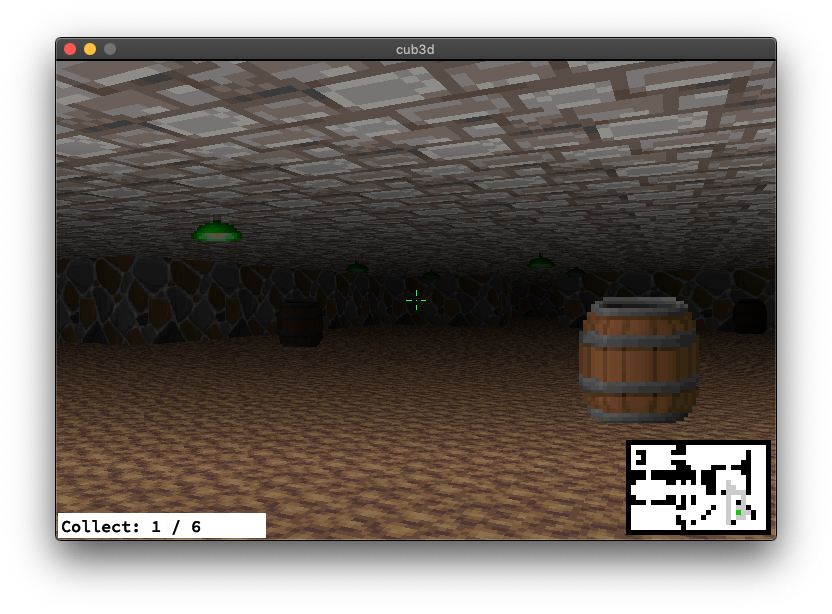

# cub3d

The goal of ``cub3d`` is to make *something* using raycasting (like [Wolfenstein 3D](https://fr.wikipedia.org/wiki/Wolfenstein_3D)).

* WASD to move, QE or Left/Right directional keys to rotate camera
* I to toggle Interface, O to toggle crosshair, L to toggle shadows
* ESC to quit
* Textures or colors for each sides (North, South, West, East) and Sky/Floor
* Shadows based on the distance
* Crosshair
* 3 different sprites
* Minimap
* Collectable items

## Ressources

* [Playable Wolfenstein 3D](http://users.atw.hu/wolf3d/)
* [Raycasting in JS](http://www.playfuljs.com/a-first-person-engine-in-265-lines/)
* [Some X11 event numbers](https://github.com/qst0/ft_libgfx)
* [Full tutorial in English](https://lodev.org/cgtutor/raycasting.html)
* [Full tutorial in French (translation of the English tutorial)](http://forums.mediabox.fr/wiki/tutoriaux/flashplatform/affichage/3d/raycasting)
* [Images in minilibx](https://github.com/keuhdall/images_example)
* [BMP format on StackOverflow](https://stackoverflow.com/questions/2654480/writing-bmp-image-in-pure-c-c-without-other-libraries)
* [BMP format explanation](https://web.archive.org/web/20080912171714/http://www.fortunecity.com/skyscraper/windows/364/bmpffrmt.html)
